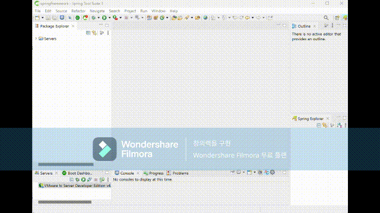
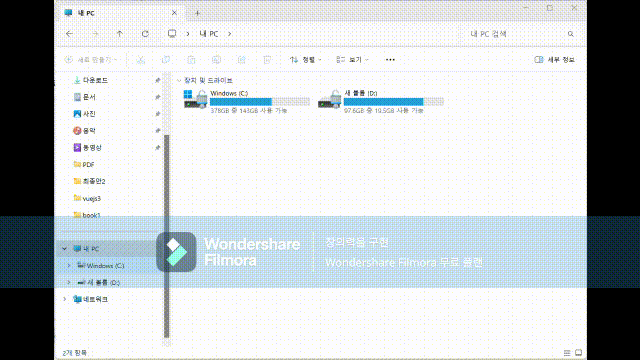

# 실습시 해당 소스코드 활용법

zip 파일로 다운로드 받아 아래와 같이 해당 프로젝트 폴더로 이동하여 npm install을 진행해야 합니다.

```command
cd 해당프로젝트폴더
npm install
```

<br><br>

# 백엔드(backend) 프로젝트 리소스

Node, jsp/Servlet, Springframework, Spring Boot, FastAPI 등의 프로젝트 경우 9장부터 14장까지 backend 디렉터리에 넣어 두었습니다.

12.3의 jsp/Servlet 프로젝트는 ecilpse에서 [File] -> [import] 메뉴를 활용하여 프로젝트를 가져옵니다.


<br><br>

12.4의 Springframework 프로젝트는 sts3(sts3.9.18)을 다운로드 받아야 하며, Java JDK11로 설정되어 있어야 작동되고, [File] -> [import] 메뉴를 활용하여 프로젝트를 가져옵니다.




<br><br>

12.5의 Spring Boot 프로젝트는 sts4(sts4-4.23.1)을 다운로드 받아야 하며, Java 17로 설정되어 있어야 작동되고, [File] -> [import] 메뉴를 활용하여 프로젝트를 가져옵니다.




<br><br><br>

# 개발 환경 구축의 각 종 소프트웨어

아래 링크는 각 종 소프트웨어 URL이니 참고하셔서 다운로드 받으시고 만약, 네이버 마이박스나 구글 드라이브를 활용하면 한 번에 다운로드 하실 수 있습니다.

네이버 마이박스: [http://naver.me/5Fmgig2W](http://naver.me/5Fmgig2W)

구글 드라이브: https://drive.google.com/drive/folders/17aCwZUhOTq3gPtjXR2766XdvQkObiaSe?usp=sharing

<br>

### Node 20.11 다운로드: 
[https://nodejs.org/ko/blog/release/v20.11.1](https://nodejs.org/ko/blog/release/v20.11.1)

### Visual Studio Code 다운로드: 
[https://code.visualstudio.com/download](https://code.visualstudio.com/download)

### MariaDB 10.11 다운로드: 
[https://mariadb.org/download/?t=mariadb&p=mariadb&r=10.11.10&os=windows&cpu=x86_64&pkg=msi&mirror=blendbyte](https://mariadb.org/download/?t=mariadb&p=mariadb&r=10.11.10&os=windows&cpu=x86_64&pkg=msi&mirror=blendbyte)

### Zulu OpenJDK JDK17 다운로드: 
[https://www.azul.com/downloads/?version=java-17-lts&os=windows&architecture=x86-64-bit&package=jdk#zulu](https://www.azul.com/downloads/?version=java-17-lts&os=windows&architecture=x86-64-bit&package=jdk#zulu)

### Zulu OpenJDK JDK11 다운로드:
[https://www.azul.com/downloads/?version=java-11-lts&os=windows&architecture=x86-64-bit&package=jdk#zulu](https://www.azul.com/downloads/?version=java-11-lts&os=windows&architecture=x86-64-bit&package=jdk#zulu)

### Python 3.12.1 다운로드: 
[https://www.python.org/downloads/release/python-3121/](https://www.python.org/downloads/release/python-3121/)

### Eclipse 2023-12 IDE for Enterprise Java and Web Developers 다운로드: 
[https://www.eclipse.org/downloads/packages/release/2023-12/r/eclipse-ide-enterprise-java-and-web-developers](https://www.eclipse.org/downloads/packages/release/2023-12/r/eclipse-ide-enterprise-java-and-web-developers)

### STS3 3.9.18 다운로드: 
[https://github.com/spring-attic/toolsuite-distribution/wiki/Spring-Tool-Suite-3](https://github.com/spring-attic/toolsuite-distribution/wiki/Spring-Tool-Suite-3)

### STS4 4.23.1 다운로드: 
[https://github.com/spring-projects/sts4/wiki/Previous-Versions](https://github.com/spring-projects/sts4/wiki/Previous-Versions)

### PyCharm 다운로드: 
[https://www.jetbrains.com/ko-kr/pycharm/download/?section=windows](https://www.jetbrains.com/ko-kr/pycharm/download/?section=windows)


